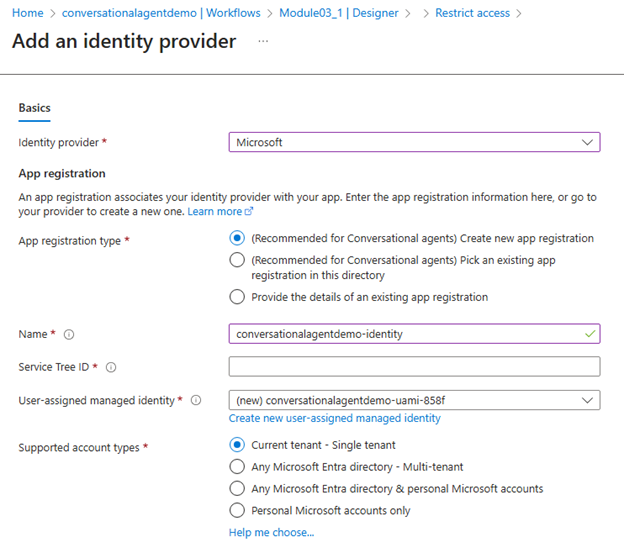
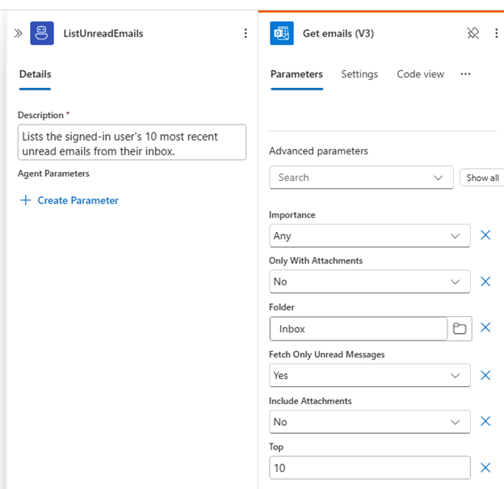
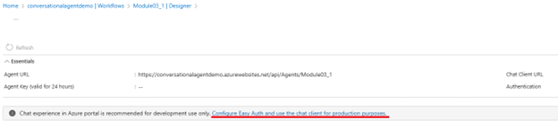
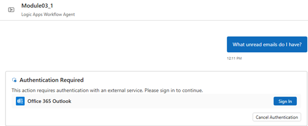
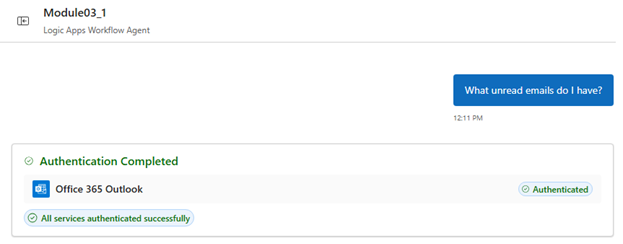

# Add user context to your tools (Module 5)

In this module, you will learn how to run connector actions with the signed-in user's identity so the agent acts on the user's behalf. This approach is commonly called on-behalf-of (OBO). You will decide when to use user context, configure connections appropriately, test with different users, and understand limitations.

By the end, you will:
- Understand user-delegated versus app-only identities for tools.
- Configure a connector-backed tool to run with user context when supported.
- Test behavior changes across users with different permissions.
- Apply best practices for consent, scopes, and error handling.

> [!IMPORTANT]
> User context in conversational agents is supported only with Microsoft first-party connectors using per-user (delegated) connections and requires App Service Authentication (EasyAuth) to be enabled on your logic app (Standard). The integrated Azure Logic Apps chat client handles token delegation for per-user connections.

Helpful resources:
- Microsoft identity platform: on-behalf-of flow: https://learn.microsoft.com/entra/identity-platform/v2-oauth2-on-behalf-of-flow
- App Service authentication and authorization overview (EasyAuth): https://learn.microsoft.com/azure/app-service/overview-authentication-authorization
- Configure Microsoft Entra ID provider (App Service authentication): https://learn.microsoft.com/azure/app-service/configure-authentication-provider-aad

---

## When to use user context (OBO)

Use user context (where supported) when a tool must respect the signed-in user's permissions, licenses, or personal data boundaries. Common examples:

- Microsoft 365: reading a user's mail, calendar, files, or profile.
- ServiceDesk/ITSM: actions that should be attributed to the requester.
- Enterprise APIs with per-user authorization or auditing requirements.

Use app-only identity when the tool performs shared operations not tied to a user (for example, posting to a shared channel, running a back-office job, or using a service account).

> [!TIP]
> Many solutions use a mix: read user data with OBO for personalization, then perform a write with an app identity after explicit confirmation.

---

## Concepts: identities for tools

- User-delegated (OBO): the connector action runs using the signed-in user's delegated token. The result depends on the user's permissions and licenses.
- App-only (application identity): the connector action runs using an app/service principal or managed identity. The result depends on app permissions and configuration.
- Connection reference: your workflow binds each connector action to a specific connection that determines how authentication is performed.

---

## Prerequisites

- An Azure subscription and a logic app (Standard) with your conversational agent from previous modules.
- Microsoft first-party connector that supports per-user (delegated) connections (for example, Microsoft 365, Microsoft Graph, SharePoint) and tenant admin consent if required.
- App Service Authentication (EasyAuth) enabled on the logic app (Standard).
- Integrated Azure Logic Apps chat client (handles token delegation for per-user connections). If you use a custom client, it must pass the user's token to the agent.
- At least two test users with different permissions in your tenant (for example, one with access to a mailbox or site; one without).

> [!NOTE]
> If you are building a custom client and cannot pass a user token yet, complete the concepts with app-only connections. In Module 10, you will integrate a custom client that supplies the user's access token to the agent.

### Configure EasyAuth (App Service Authentication)

Enable EasyAuth on your logic app (Standard) so delegated user identity can flow to eligible first-party connectors:

1. In the Azure portal, open your logic app (Standard) resource.
2. Select Authentication in the left navigation.
3. Select Add identity provider and choose Microsoft (Microsoft Entra ID).
4. Follow the guided setup to create or select an app registration and configure sign-in. Require authentication for requests as appropriate for your environment.
5. Save the configuration.

Helpful links:
- App Service authentication and authorization overview: https://learn.microsoft.com/azure/app-service/overview-authentication-authorization
- Configure Microsoft Entra ID provider (App Service authentication): https://learn.microsoft.com/azure/app-service/configure-authentication-provider-aad

---

## Step 1 — Choose the identity model per tool action

For each tool action, decide how it should authenticate:

- Use user context (OBO) for user-personalized operations (for example, "Get my upcoming meetings").
- Use app-only for shared resources or automations (for example, "Post today's health status to the ops channel").

Document the required scopes/permissions for each tool so you can consent them later.

---

## Step 2 — Create a per-user connection (delegated)

Create a new connector connection used by your tool to support delegated user access:

1. In your agent workflow, add or open the connector action you want to run with user context (for example, Microsoft Graph or Microsoft 365 action).
2. When prompted to select or create a connection, select Create new and enable the "Create as per-user connection?" option in the connection dialog. This checkbox is required and is available only for Microsoft first-party connectors. If you do not see it, you may be editing an existing app-only connection—create a new connection instead.
3. Complete the sign-in/consent flow. Any sign-in here is for validation/consent only; at runtime, each chat user will authenticate on first use and their identity will be used for subsequent calls.

> [!IMPORTANT]
> Per-user connections must be created using the "Create as per-user connection?" option and are supported only for Microsoft first-party connectors. You cannot convert an existing app-only connection to per-user; create a new per-user connection. Ensure EasyAuth is enabled on your logic app (Standard) so delegated identity can flow. At runtime in the integrated Azure Logic Apps chat client, each user is prompted on first use and their identity is used thereafter.

---

## Example: List the signed-in user's unread Outlook emails

This example shows how to add a tool that lists the signed-in user's unread emails using the Outlook connector with user context (OBO).

### Step 1 — Add the Outlook connector action
- In your agent workflow, add a new tool.
- Choose to create from a Connector action and search for "Office 365 Outlook".
- Select the action "Get emails (V3)" or similar (action names may vary slightly).

### Step 2 — Configure the per-user connection
- When prompted to select or create a connection, select **Create new** and enable the **Create as per-user connection?** option.
- Complete the sign-in consent flow to authorize the app to use your credentials.

### Step 3 — Set up the action
- In the action's parameters, set:
	- **Folder**: Inbox
	- **Fetch only unread messages**: Yes
	- **Top**: 10

### Step 4 — Name and describe the tool
- Tool name: `ListUnreadEmails`
- Description: Lists the signed-in user's 10 most recent unread emails from their Inbox.
- Save the workflow.

### Step 5 — Test in chat
- With EasyAuth configured, the portal chat client will no longer be available. You can access the integrated chat client of the website via "Configure Easy Auth and use the chat client for production purposes".
- Ask: "What unread emails do I have?"
- The agent should prompt for sign-in if this is the first time the user uses the tool, then return a summary of unread emails (subject, sender, received time).

> [!TIP]
> You can use a similar pattern for other Microsoft 365 connectors, such as OneDrive (list my recent files) or Teams (list my joined teams or recent messages). Use the per-user connection option for OBO scenarios.

### What to expect in chat (first use and reuse)

When a tool first uses a per-user connector action in the integrated Azure Logic Apps chat client, an authentication prompt appears for the user to sign in (for example, an "Authentication Required" panel with a Sign in button). After the user signs in once, subsequent calls using the same per-user connection do not require re-authentication.

> [!NOTE]
> The credentials used are those of the user in the chat session, not the creator of the per-user connection. This ensures the tool runs with the signed-in user's permissions.

---

## Step 3 — Test with users who have different access

1. Open the chat client and start a session as User A.
2. Ask the agent to perform an operation that requires user context (for example, "What are my latest unread emails?").
3. Confirm the tool runs successfully and results reflect User A's data/permissions.
4. Repeat as User B and verify the tool runs successfully and reflects User B's data/permissions (results may differ from User A based on access).

> [!TIP]
> Keep tool descriptions concise and include guidance about what data they access. For example: "Gets the signed-in user's next five calendar events."

## Step 4 — Plan for client integration (token pass-through)

If your production experience uses a custom chat client (web, mobile, or another service), plan to supply the user's access token to the agent and implement the OBO flow.

- Capture the user's sign-in via your app and obtain an access token for the target resource (for example, Microsoft Graph) with the required scopes.
- Pass the token to your agent invocation per your integration model (covered in Module 10).
- Configure your tool to use the delegated token or a connection that recognizes the user's context.

See [Module 10 — Connect your agents using A2A protocol](./10-connect-agents-a2a-protocol.md) for details.

---

## Best practices

- Least privilege: request the minimal delegated scopes needed for each tool and avoid broad permissions.
- Clear feedback: instruct the agent to summarize permission errors briefly and suggest remediation (for example, "You might not have access to this mailbox").
- Sensitive data: avoid echoing PII or secrets. Redact or summarize as needed.
- Mixed identity patterns: use user context for reads and app-only for writes after explicit confirmation.
- Auditing and logging: use run history and telemetry to track which tools ran and under which identity (user or app).

---

## Next steps

- Module 06 — Extend your tool functionality with best-pracitce patterns.
- Module 10 — Connect your agents using A2A protocol (client integration and delegated tokens).