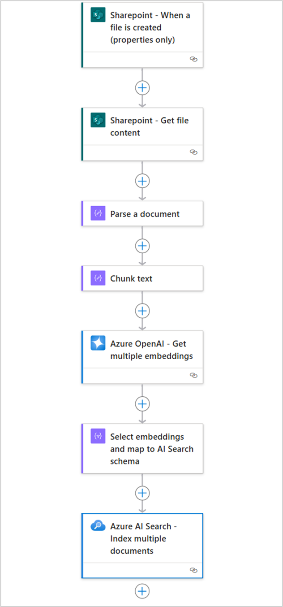

# Module 07 - Add knowledge to your agent

## The Power of RAG in AI Applications

Retrieval-Augmented Generation (RAG) represents a transformative approach to building intelligent conversational agents that can access and leverage external knowledge sources in real-time. By combining the generative capabilities of Large Language Models (LLMs) with dynamic information retrieval, RAG enables AI applications to provide accurate, contextual, and up-to-date responses that go far beyond the limitations of pre-trained model knowledge.

### Key Benefits of RAG in AI Applications

**🎯 Enhanced Accuracy and Relevance**
- Provides access to current, domain-specific information that wasn't available during model training
- Reduces hallucinations by grounding responses in verified, retrieved content
- Enables precise answers to specific questions about your organization's data and processes

**📚 Dynamic Knowledge Integration**
- Seamlessly incorporates information from documents, databases, APIs, and knowledge bases
- Updates responses automatically as underlying data sources change
- Eliminates the need for expensive model retraining when information is updated

**🔍 Contextual Understanding**
- Retrieves the most relevant information based on user queries and conversation context
- Combines multiple sources to provide comprehensive, well-rounded responses
- Maintains conversation flow while accessing external knowledge on-demand

**⚡ Cost-Effective Scalability**
- Reduces computational costs compared to training larger models with embedded knowledge
- Enables organizations to leverage existing data investments without data migration
- Scales efficiently as knowledge bases grow and evolve

**🛡️ Trust and Transparency**
- Provides source attribution for generated responses
- Enables fact-checking and verification of information
- Builds user confidence through transparent knowledge sourcing

### RAG in Logic Apps: Bridging AI and Enterprise Data

Logic Apps provides multiple pathways to implement RAG patterns, from simple data composition to sophisticated AI Search integrations. This module explores various approaches to enriching your conversational agents with organizational knowledge, enabling them to become truly intelligent assistants that understand your business context.

## Implementation Approach

RAG implementation in Azure Logic Apps follows a two-phase architecture that transforms your enterprise data into intelligent, conversational experiences:

### Phase 1: Data Ingestion and Indexing
In this foundational phase, Logic Apps orchestrates the process of bringing your data into the AI ecosystem. Your documents, databases, and content sources are processed through Logic Apps workflows that:
- **Parse and extract** text content from various file formats (PDFs, Word docs, web pages, etc.)
- **Transform and chunk** the data into manageable segments for optimal retrieval
- **Generate embeddings** using AI models to create vector representations of your content
- **Index the embeddings** in specialized data stores like Azure AI Search, Azure Cosmos DB, or vector databases

### Phase 2: Conversational Retrieval and Response Generation
When users interact with your agent, Logic Apps handles the intelligent retrieval and response process:
- **Process user questions** by converting them into embedding vectors using the same AI models
- **Search the knowledge base** to find the most semantically similar content to the user's query
- **Retrieve relevant context** from the indexed data store based on similarity scores
- **Combine retrieved information** with the user's question and send to the LLM
- **Generate contextual responses** that are grounded in your organizational knowledge

This two-phase approach ensures that your conversational agents can access and reason about your specific data while maintaining the natural language capabilities of modern LLMs.

Azure Logic Apps provides a comprehensive suite of document processing and transformation actions that enable seamless data ingestion from diverse sources and document formats.

## Document Ingestion for Gen AI Applications

With over 1,400 enterprise connectors, Logic Apps provides unparalleled access to a wide range of systems, applications, and databases, making it easier than ever to create powerful generative AI applications. By leveraging connectors like Azure OpenAI and Azure AI Search, businesses can seamlessly implement the Retrieval-Augmented Generation (RAG) pattern, allowing the ingestion and retrieval of data from multiple sources with ease.

[Document Ingestion for Gen AI Applications using Logic Apps from 1000+ data sources!](https://techcommunity.microsoft.com/blog/integrationsonazureblog/document-ingestion-for-gen-ai-applications-using-logic-apps-from-1000-data-sourc/4250675)

## Advanced RAG using Azure AI Search

Azure AI Search provides enterprise-grade search capabilities that enable sophisticated RAG implementations by indexing and retrieving relevant content from large document collections. It supports semantic search, vector search, and hybrid search approaches, allowing your conversational agents to find the most contextually relevant information from unstructured documents, PDFs, web pages, and structured data sources. With built-in AI enrichment capabilities, Azure AI Search can extract entities, key phrases, and semantic meaning from documents during indexing, creating a rich knowledge base that enhances the quality and precision of your agent's responses.

[Automate RAG Indexing: Azure Logic Apps & AI Search for Source Document Processing](https://techcommunity.microsoft.com/blog/azure-ai-foundry-blog/automate-rag-indexing-azure-logic-apps--ai-search-for-source-document-processing/4266083)
