--- 
title: 07 - Deploy your agents to Microsoft Teams
description: Learn how to deploy Logic Apps conversational agents to Microsoft Teams to enable interacting with agents through the Teams chat.
ms.service: logic-apps
ms.topic: tutorial
ms.date: 11/12/2025
author: brbenn
ms.author: brbenn
---

This module demonstrates how to deploy Logic Apps conversational agents to Microsoft Teams, enabling users to interact with intelligent agents directly through Teams chat interface.

When finished with this module, you'll have gained the following knowledge:

- **Teams Integration Architecture**: Understanding the three-component architecture involving Microsoft Teams, Azure Bot Service, and Logic Apps
- **Azure Bot Service Configuration**: How to create and configure Azure Bot Service as a proxy between Teams and Logic Apps
- **Custom Proxy Implementation**: Building a web application that implements the bot activity protocol to bridge Teams and Logic Apps
- **Teams App Manifest Creation**: Creating and configuring Teams app manifests for sideloading custom agents
- **End-to-End Deployment**: Complete workflow from local development to Teams production deployment

## Architecture Overview

The integration between Microsoft Teams and Logic Apps involves three key components:

1. **Microsoft Teams** - The client interface where users interact with the agent
2. **Azure Bot Service** - Intermediate service that handles authentication, schema validation, and message routing
3. **Custom Proxy Application** - Web application that implements the bot activity protocol and communicates with Logic Apps via A2A (Application-to-Application)

> :::note
> Azure Bot Service acts as an intermediary between Microsoft Teams and Azure Logic Apps. It manages authentication, validates schemas, and routes messages. This ensures that communication flows through the service, with no direct interaction between Microsoft Teams and the agentic workflow..

## Prerequisites

- Azure subscription with Logic Apps Standard
- Microsoft Teams with tenant admin permissions
- Visual Studio or VS Code
- Logic Apps agent already created and configured
- GitHub repository access (sample code available)

## Step 1: Create Logic App Agent

1. In the [Azure portal](https://portal.azure.com), find or create a Standard conversational agent workflow.
   - Ensure you have a Logic Apps agent configured with an Agent workflow with conversation handling
   - Open our workflow in the **Designer**, click on the **Chat session** trigger and make note of the **Agent URL** - this will be used later when configuring the Proxy app
   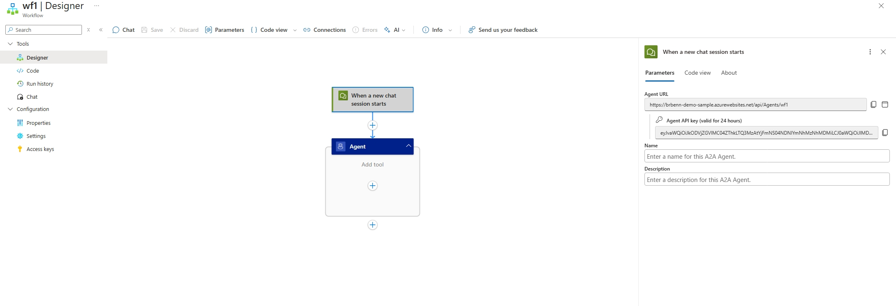
2. Configure your app's Easy Auth settings
   - Go to the **Authentication** settings page under the *Settings** menu
   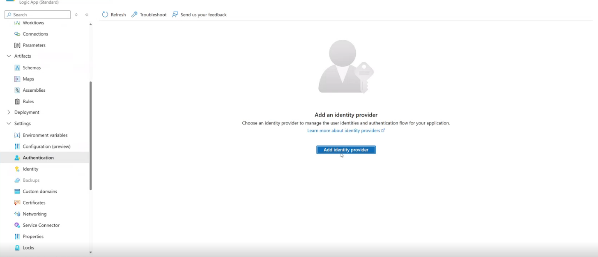
   - Click **Add an Identity Provider**
   - On the **Identity provider** drop down select **Microsoft**
   - For **App registration type** select **Create new app registration**
   - For **Name** use a name similar to your Logic App's name
   - For **Client secret expriation** select **Recommended: 180 days**
   - For **Supported account types** select **Current tenant - Single tenant**
   - All items under **Additional checks** can be left as their default value
   - All items under **App Service authentication settings** can be left as their default value
   - Click **Add**  
   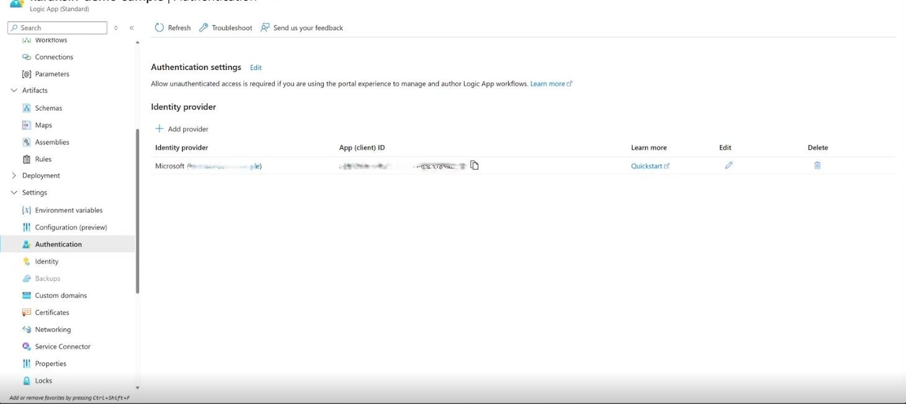

3. Confiure the workflow's AAD App settings
   - From the **Authentication** page, click the link to the AAD app (this will have the name you used in the **Add an Identity Provider** step)
   - From the AAD App, click the **Authentication** page under the **Manage** menu group
 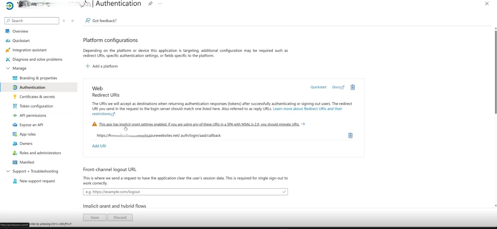
   - Under **Web** click **Add URI**
   - Add the value **https://token.botframework.com/.auth/web/redirect**
 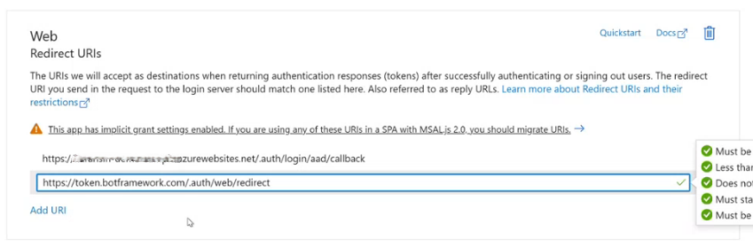
   - Click **Save**
   - Go to the **Expose an API** page under the **Manage** menu group
   - Note the **Scopes** value - this will be used later for the Bot service authentication
   - Note the **App (client) ID**, and **Tenant ID** - these will be used later for the Bot service authentication 

> :::tip
> Test your Logic Apps agent in the portal first using the agent URL before proceeding with Teams integration.

## Step 2: Create Azure Bot Service
1. In the [Azure portal](https://portal.azure.com), create a new Azure Bot
   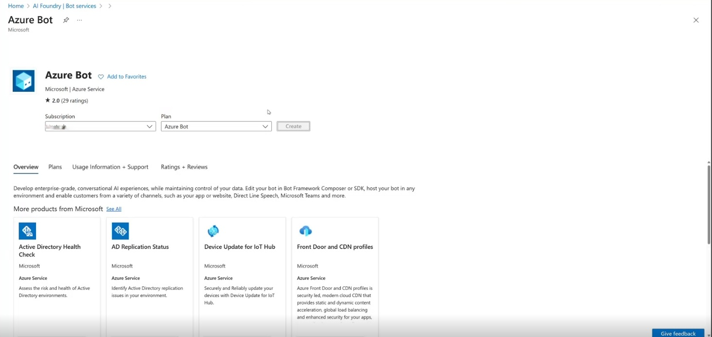
   - Add a **Bot handle**, **Subscription**, and **Resource group**, all other properties can remain set to their default values
   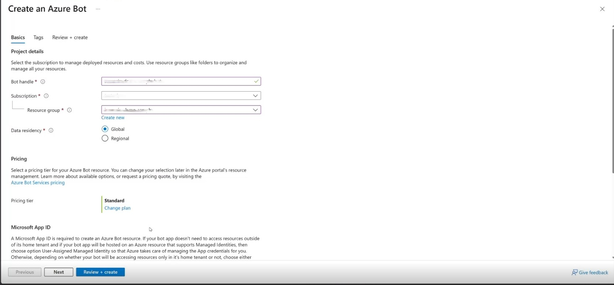

2. **Configure Bot Settings**
   - Once the Bot resource is create navigate to the **Configuration** page under the **Settings** 
   - Click **Manage Password** next to **Microsoft App ID**
      - Now on the **Certificates and secrets** page
      - Click **+ New client secret**. Add a **Description** and keep **Expires** set to its default value.
      - Click Add
      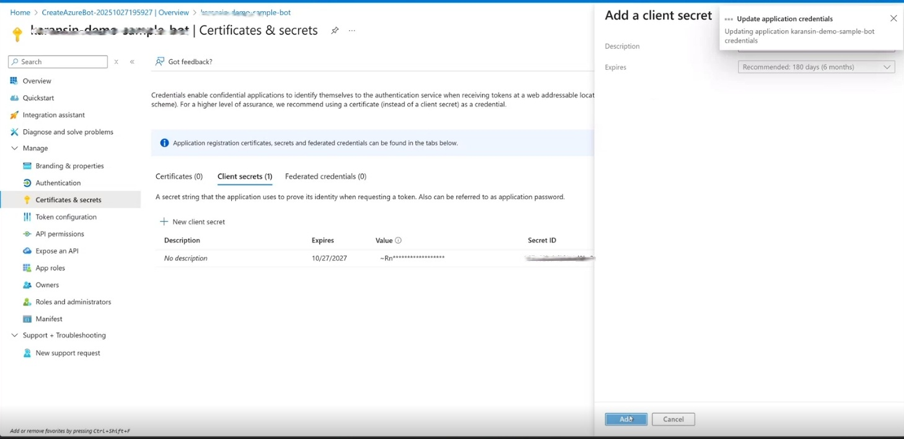
     - Note the **Bot Secret** value. This will be used later during the Teams manifest update
   - Back on the Bot resource **Configuration** page, note the **Bot ID** (Microsoft App ID), and **Tenant ID** - you'll need these for Teams manifest later
   - Create the OAuth connection
     - From the **Configuration** page click **Add OAuth Connection Settings**
     - For **Name** use the value **logicapp**
     - For **Provider** select **Azure Active Directory v2**
     - For **Client ID** use the **App (client) ID** you noted from the Logic Apps AAD App
     - For **Client secret**, use the secret value you noted from the Logic Appsw AAD App
     - The **Token exchange URL** can be left blank
     - For **Tenant ID**, use the **Tenant ID** value you noted from the Logic App AAD App
     - For **Scopes**, use the **Scopes** value you noted frorm the Logic App AAD App
      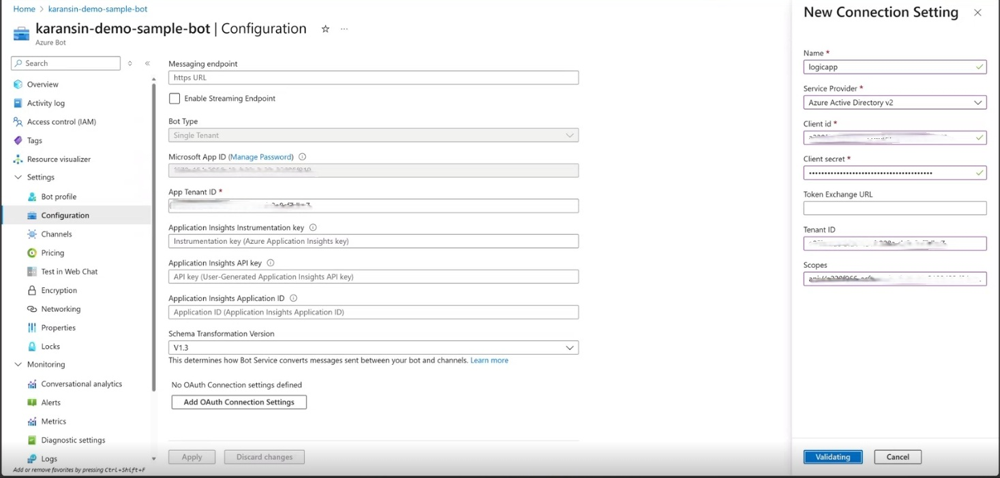
     - Click Save
     - Test the connection
        - Click the newly created OAuth connection link
        - On the opened tab, click **Test Connection**
        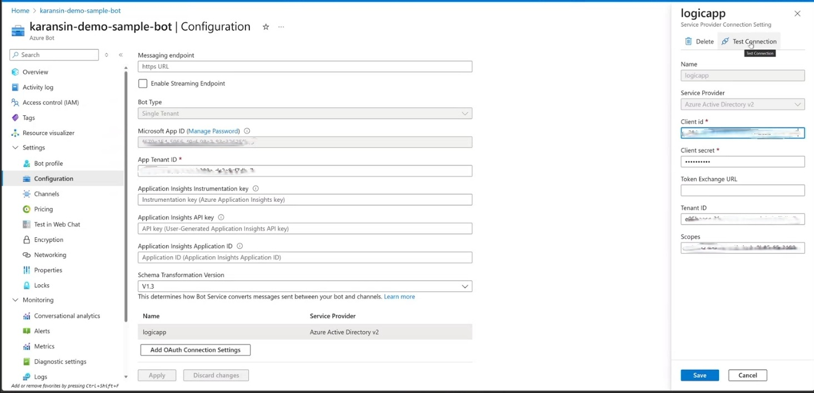
        - This will open a page showing a successful connection was made. This the connection fails, review the OAuth connection setup instructions.
        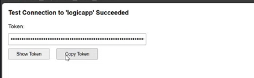

## Step 3: Setup Custom Proxy App and Deploy

The proxy application bridges the gap between Azure Bot Service and Logic Apps since Logic Apps doesn't directly support the bot activity protocol.

### Key Components:

1. **Bot Activity Protocol Implementation**
   - Handles incoming messages from Azure Bot Service
   - Implements proper message formatting and response handling

2. **A2A Integration with Logic Apps**
   - Converts bot messages to Logic Apps A2A format
   - Manages conversation context and state mapping
   - Handles authentication tokens and headers

3. **Conversation ID Mapping**
   - Maps Teams conversation IDs to Logic Apps context IDs
   - Enables stateless operation without requiring custom storage
   - Handles conversation lifecycle and error recovery

The proxy app can be found here: 


1. Clone the [link to custom proxy app](../../../samples/la-teams-integration) to your local machine
1. Open the solution in Visual Studio
1. Open the appsettings.json file
1. Replace **{{BOT_CLIENT_ID}}** with the Bot ID you noted from the Bot setup section
1. Replace **{{BOT_TENANT_ID}}** with the Tenant ID you noted from the Bot setup section
1. Replace **{{BOT_SECRET}}** with Bot secret you noted from the Bot setup section
1. Replace **{{LOGICAPP_AGENT_URL}}** with the agent URL you noted from the Logic App 
1. Save the file

### Deploy to Azure:

1. **Deploy to Azure App Service**
   ```bash
   # Deploy using Azure CLI or Visual Studio publish
   az webapp deployment source config-zip --resource-group myResourceGroup --name myAppServiceName --src myapp.zip
   ```
   To publish in Visual Stuio, right-click on the solution and select **Publish**. In the Publish dialog: Choose Azure as the target. Select the specific deployment target (Windows). Follwing the wizard to deploy the application to Azure App Service. 
   
   Once deployed, go to the [Azure portal](https://portal.azure.com) and navigate to your App Service resource. Find and note the **default domain** - this values will be used in the next section.

### Update the Bot Service:

1. **Update Bot Service Configuration**
   - In the [Azure portal](https://portal.azure.com), navigate to your Bot service.
   - Go to the **Configuration** page under the **Settings** menu
   - Update the **Messaging endpoint** with the **default domain** values from the previous set and append the following to the URL: **"/api/messages"**
   - The URL should have the following structure: `https://your-app-service.azurewebsites.net/api/messages`
   - Click **Save**
   - Navigate to the **Channels** page under the **Settings** menu group
   - Click **Microsoft Teams** channel
   - Accept terms of service
   - Click **Apply**


## Step 5: Configure Teams Integration
   
### Upload Teams App Manifest:

2. **Required Files**:
   - `manifest.json` (configuration file)
   - `color.png` (192x192 color icon)
   - `outline.png` (32x32 outline icon)

3. Update files
   - Go back to your Visual Studio solution
   - Open the **manifest.json** file under the **appManifest** folder
   - Replace **{{BOT_CLIENT_ID}}** with your Bot client ID
   - Replace **{{BOT_TENANT_ID}}**
   - Replace **{{AGENT_DISPLAY_NAME_SHORT}}** with **Test Logic App Agent**
   - Replace **{{AGENT_DISPLAY_NAME_LONG}}** with **Test Logic App Agent**
   - Save the file

3. **Package Creation**:
   - Compress all files under **appManifest** into a ZIP archive
   - Ensure ZIP contains files at root level (not in subfolder)

### Sideload Teams App:

2. **Upload in Teams**
   - In Teams client: Apps > Manage your apps > Upload a custom app
   - Select **Upload for [your organization]**
   - Choose your ZIP file

## Step 6: Testing and Validation

### Test Scenarios:
A new chat will appear in you chat list with the name of your bot. Open this chat and type **hello** to being your chat session with your Logic Apps agent.

1. **Basic Conversation**
   - Send simple messages and verify responses
   - Check authentication flow (OAuth sign-in)
   - Verify conversation continuity

3. **Error Handling**
   - Test with invalid inputs
   - Verify graceful error recovery
   - Check conversation reset functionality

### Troubleshooting:

- **Authentication Issues**: Check OAuth configuration and token handling
- **Message Delivery**: Verify Azure Bot Service messaging endpoint
- **Conversation State**: Ensure conversation ID mapping is working correctly
- **Teams Manifest**: Validate JSON schema and required fields
