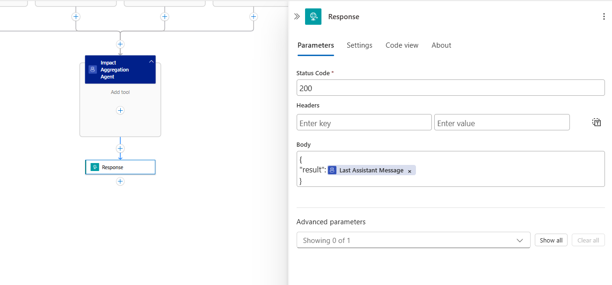
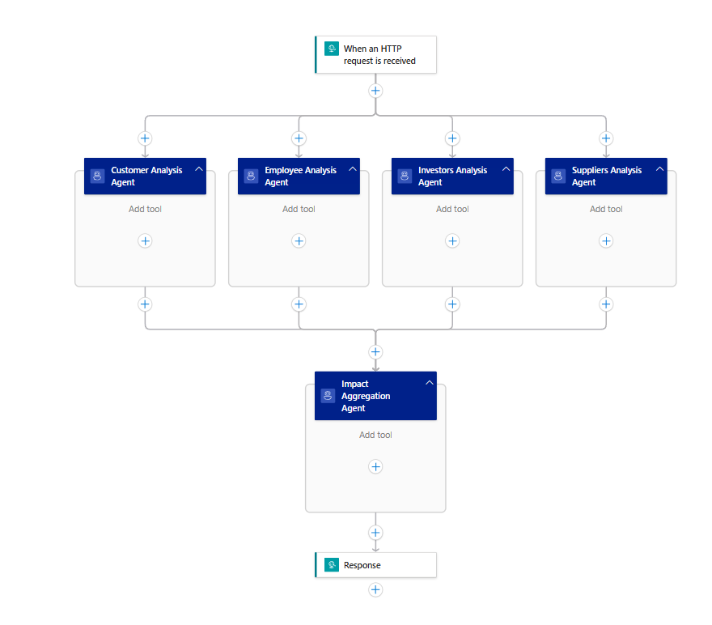

# Parallelization Pattern (Module 03)

In this module, you learn how to implement the parallelization pattern in Azure Logic Apps. This pattern distributes independent subtasks across multiple agents for concurrent processing, trading sequential accuracy for speed and diverse perspectives.

When you finish this module, you'll achieve the goals and complete the tasks in the following list:

• Understand when and why to use parallelization
• Build concurrent agent workflows in Logic Apps
• Implement sectioning for independent subtasks
• Create voting mechanisms for consensus-based decisions
• Handle partial failures and aggregate results
• Monitor and optimize parallel execution performance

## What is Parallelization?

Parallelization is a workflow pattern that distributes independent subtasks across multiple agents for concurrent processing. As described by Anthropic, this pattern "processes multiple inputs concurrently with the same prompt" or breaks tasks into parallel sections that can run simultaneously.

### Key Benefits

- **Speed**: Simultaneous execution reduces overall processing time
- **Focused Attention**: Each agent concentrates on specific aspects
- **Diverse Perspectives**: Multiple viewpoints increase result reliability
- **Fault Tolerance**: Failure of one agent doesn't block others
- **Scalability**: Easy to add more parallel agents as needed

### When to Use This Pattern

Use parallelization when:
- Subtasks can be processed independently
- Multiple perspectives improve confidence in results
- Different aspects of a task need focused attention
- Speed is more important than sequential processing
- You need consensus-based decision making

## Example Scenario

We'll build a **stakeholder impact analysis system** that analyzes how market changes affect different stakeholder groups concurrently. This example is based on the Anthropic cookbook parallelization pattern but adapted for Logic Apps.
The implementation involves a request trigger to receives the inputs and a response action to return the result.

**Input**: Market change scenario description
**Parallel Agents**:
1. **Customer Impact**: Analyze effects on customers
2. **Employee Impact**: Assess workforce implications  
3. **Investor Impact**: Evaluate financial consequences
4. **Supplier Impact**: Review supply chain effects

**Output**: Comprehensive multi-stakeholder impact analysis with recommendations

## Prerequisites

• An Azure account and subscription. If you don't have a subscription, [sign up for a free Azure account](https://azure.microsoft.com/free/?WT.mc_id=A261C142F).
• A Standard logic app resource with agent capabilities enabled.
• Completion of previous modules in the conversational agents series.

If you don't have this setup, see [Module 1 - Create your first conversational agent](../02_build_conversational_agents/01-create-first-conversational-agent.md).

## Part 1 - Build a Basic Parallelization Workflow

In this section, you'll create a four-agent parallel workflow that receives market change data in an HTTP request and processes it simultaneously across different stakeholder perspectives before aggregating the results.

### Step 1 - Create the workflow

In the Azure portal, open your Standard logic app resource.

Add a new autonomous agent workflow in the designer.

### Step 2 - Add the Customer Impact Agent

1. Configure the agent with the following settings:
   - **Name**: Customer Analysis Agent
   - **System Instructions**: 
     ```
     Analyze how market changes will impact customers. Focus on:
     - Price sensitivity and purchasing power
     - Technology demands and expectations
     - Environmental consciousness
     - Service quality expectations
     
     Provide specific impacts and recommended actions.
     Format with clear sections and priorities.
     ```
   - **User Instructions**: 
     ```
     Analyze customer impact for this market scenario: @{triggerBody()?['scenario']}
     ```

### Step 3 - Add the Employee Impact Agent

1. Configure this agent to run in parallel with the Customer Impact Agent
2. Configure the agent with these settings:
   - **Name**: Employee Analysis Agent  
   - **System Instructions**:
     ```
     Analyze how market changes will impact employees. Focus on:
     - Job security concerns
     - Skills gap and development needs
     - Strategic direction clarity
     - Career progression opportunities
     
     Provide specific impacts and recommended actions with implementation timeline.
     ```
   - **User Instructions**: 
     ```
     Analyze employee impact for this market scenario: @{triggerBody()?['scenario']}
     ```

### Step 4 - Add the Investor Impact Agent

1. Configure this agent to run in parallel with the other agents
2. Configure the agent with these settings:
   - **Name**: Investors Analysis Agent
   - **System Instructions**:
     ```
     Analyze how market changes will impact investors. Focus on:
     - Financial performance expectations
     - Risk management requirements
     - Communication and transparency needs
     - Return on investment concerns
     
     Provide timeline recommendations and key success metrics.
     ```
   - **User Instructions**: 
     ```
     Analyze investor impact for this market scenario: @{triggerBody()?['scenario']}
     ```

### Step 5 - Add the Supplier Impact Agent

1. Configure this agent to run in parallel with the other agents
2. Configure the agent with these settings:
   - **Name**: Suppliers Analysis Agent
   - **System Instructions**:
     ```
     Analyze how market changes will impact suppliers. Focus on:
     - Capacity constraints and scaling needs
     - Price pressures and margin impacts
     - Technology transitions required
     - Supply chain resilience
     
     Include monitoring metrics and long-term strategic recommendations.
     ```
   - **User Instructions**: 
     ```
     Analyze supplier impact for this market scenario: @{triggerBody()?['scenario']}
     ```

### Step 6 - Add Result Aggregation

1. Add a final agent that processes all parallel outputs
2. Configure the aggregation agent:
   - **Name**: Impact Aggregation Agent
   - **System Instructions**:
     ```
     Synthesize the parallel stakeholder impact analyses into an executive summary.
     
     Structure the output as:
     1. Executive Summary
     2. Critical Cross-Stakeholder Dependencies  
     3. Priority Action Items
     4. Resource Requirements
     5. Implementation Timeline
     6. Risk Mitigation Strategies
     ```
   - **User Instructions**:
     ```
     Customer Analysis: @{outputs('Customer_Analysis_Agent')?['lastAssistantMessage']}     
     Employee Analysis: @{outputs('Employee_Analysis_Agent')?['lastAssistantMessage']}     
     Investor Analysis: @{outputs('Investors_Analysis_Agent')?['lastAssistantMessage']}     
     Supplier Analysis: @{outputs('Suppliers_Analysis_Agent')?['lastAssistantMessage']}
     ```
  >[!IMPORTANT]
  >
  >The expressions `@{outputs('Customer_Impact_Agent')?['lastAssistantMessage']}` etc. insert the outputs from each parallel agent into the aggregation agent's input.

### Step 6 - Add Response action and return the outputs of the aggregation agent as the result

  Screenshot showing the completed response action: 
   

  Screenshot showing the completed parallel agents:     
   
  

### Step 7 - Test the parallel workflow

1. Use this sample input data:
   ```json
   {
     "scenario": "Market Analysis: Rising inflation, increased competition, technological disruption in our industry, and growing environmental regulations. Consumer preferences shifting toward sustainable products. Supply chain costs increasing by 15-20%. New AI-powered competitors entering the market."
   }
   ```

2. Expected parallel processing:
   - **Customer Agent**: Analyzes price sensitivity, tech demands, environmental concerns
   - **Employee Agent**: Evaluates job security, skills needs, strategic direction
   - **Investor Agent**: Assesses financial performance, risk management, communication needs
   - **Supplier Agent**: Reviews capacity constraints, price pressures, tech transitions
   - **Aggregation Agent**: Synthesizes all analyses into executive summary

  A video showing testing of parallel agents:
  
   <video width="800" controls>
      <source src="media/03-parallelization-pattern/testing_parallel_agents.mp4" type="video/mp4">
      Your browser does not support the video tag. <a href="media/03-parallelization-pattern/testing_parallel_agents.mp4">Download the video</a> to view the steps for testing the prompt chaining agent.
   </video>

## Best Practices for Parallelization

- **Independence**: Ensure parallel tasks don't depend on each other's outputs
- **Load Balancing**: Design agents with similar processing complexity
- **Timeout Management**: Set appropriate timeouts for parallel operations
- **Result Aggregation**: Plan how to combine and synthesize parallel outputs
- **Error Handling**: Implement graceful degradation when some agents fail
- **Resource Management**: Monitor concurrent resource usage
